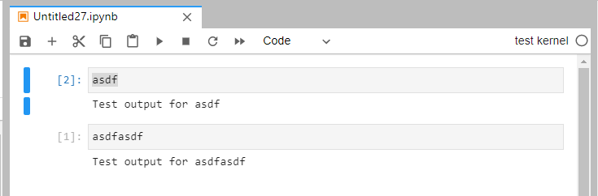

Just creating a very simple Jupyter kernel.


## Usage
```
git clone https://github.com/akkiolive/TestKernel.git
cd TestKernel
pip install -e .
python install_kernel.py
jupyter lab
```

## What is done
### 1. Install the kernel named "testkernel"
### 1-1. Prepare files:
```
WorkingDir(TestKernel)
    |-setup.py
    |-install_kernel.py
    |-testkernel
        |-__init__.py
        |-__main__.py
        |-kernel.py
```

- `setup.py`
```python
from setuptools import setup

setup(
   name='testkernel',
   version='0.1',
   packages=['testkernel']
)
```
- `install_kernel.py`
```python
import json
import os
import sys

from jupyter_client.kernelspec import KernelSpecManager
from IPython.utils.tempdir import TemporaryDirectory


kernel_name = "testkernel" # this is also used for package name in kernel_json
display_name = "test kernel"
language_name = "test language"

kernel_json = {
    "argv": [
        "python3",
        "-m",
        kernel_name,
        "-f",
        "{connection_file}"
    ],
    "display_name": display_name,
    "language": language_name
}


def install_my_kernel_spec(kernel_name, user=False, prefix=None):
    with TemporaryDirectory() as td:
        os.chmod(td, 0o755)  # Starts off as 700, not user readable
        with open(os.path.join(td, 'kernel.json'), 'w') as f:
            json.dump(kernel_json, f, sort_keys=True)
        # TODO: Copy resources once they're specified

        print('Installing IPython kernel spec')
        KernelSpecManager().install_kernel_spec(td, kernel_name, user=user, prefix=prefix)
        
install_my_kernel_spec(kernel_name=kernel_name)
```


- `__init__.py`

This is an empty file.


- `__main__.py`
```python
from ipykernel.kernelapp import IPKernelApp
from .kernel import TestKernel
IPKernelApp.launch_instance(kernel_class=TestKernel)
```

- `kernel.py`
```python
from ipykernel.kernelbase import Kernel

class TestKernel(Kernel):
    implementation = 'testkernel'
    implementation_version = "0.1"
    banner = None
    
    def do_execute(self, code, silent, store_history=True, user_expressions=None, allow_stdin=True):
        self.send_response(self.iopub_socket, 'stream', {'name': 'stdout', 'text': f'Test output for {code}'})
        return {'status': 'ok', 'execution_count': self.execution_count, 'payload': [], 'user_expressions': {}}
```

### 1-2. Install the kernel package
On the directory locates `setup.py`, hit following command.
```
pip install -e .
```

### 1-3. Install the kernel for Jupyter
```
python install_kernel.py
```

### Then, use it on Jupyter.
```
jupyter lab
```


## How to remove
Remove kernel package:
```
pip uninstall testkernel
```
Remove Jupyter kernel:
```
jupyter kernelspec uninstall kernelspec
```
